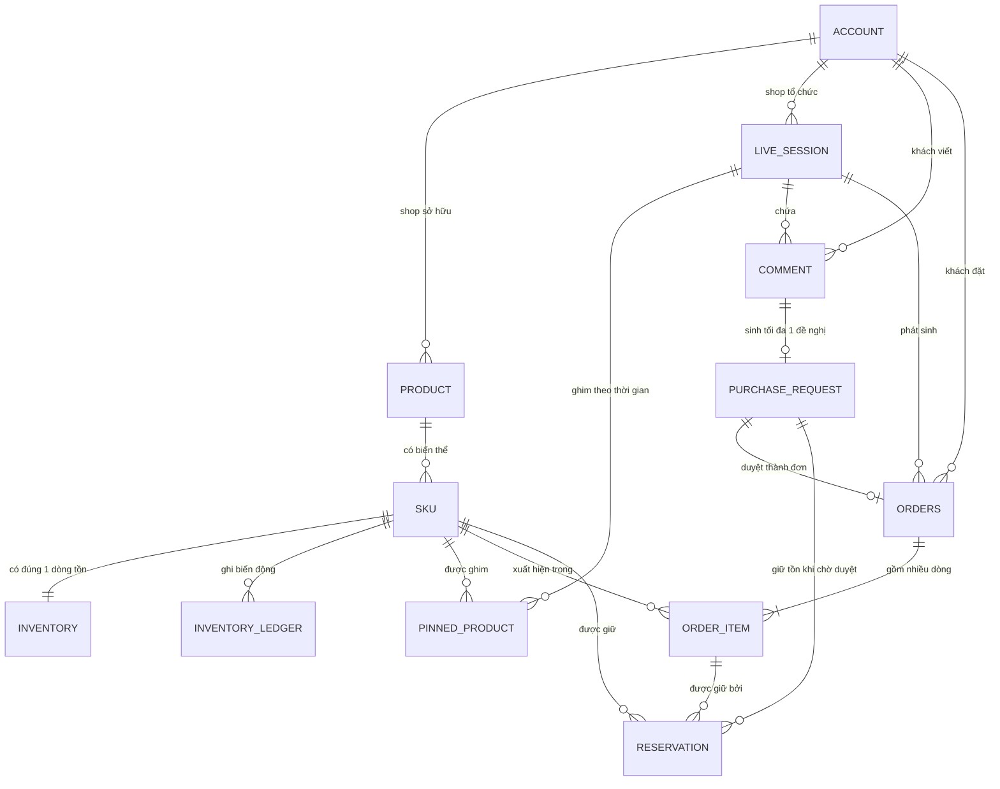

# ERD sau khi cập nhật — Đơn nháp & Giữ hàng

> Bản này thay thế phần liên quan trong `docs/ERD/ERD_LiveCommerce.docx`.
> Căn cứ: 3 quyết định thiết kế ở [README.md](README.md) mục 2, checklist thay đổi ở mục 10.
> Cập nhật: 2026-09-22

---

## 1. Bảng nào cần hoàn thiện

Đây là toàn bộ bảng cần có trước khi viết migration (T2). Cột **Việc cần làm** là thứ phải sửa so với ERD hiện tại.

| # | Bảng | Schema | Trạng thái | Việc cần làm |
|---|---|---|---|---|
| 1 | `account` | commerce | 🟡 Bổ sung | Thêm `platform_user_id` (map Facebook user → CRM), `phone`, `address`, `risk_score`, `order_count`, `reject_count` |
| 2 | `product` | commerce | 🟢 Đủ | — |
| 3 | `sku` | commerce | 🟡 Bổ sung | Tách `variant` thành `size` + `color` (để khớp "2 cái size L"), thêm `status`, `alias` (mã tắt host hay đọc) |
| 4 | `inventory` | commerce | 🔴 **Sửa** | `available_qty` → `on_hand_qty`; thêm `sellable_qty` (dẫn xuất), `version`, 2 CHECK constraint |
| 5 | `inventory_ledger` | commerce | 🔴 **Thêm mới** | Nhật ký biến động kho — UC *Quản lý tồn kho* yêu cầu |
| 6 | `live_session` | commerce | 🟡 Bổ sung | Thêm `hold_ttl_seconds`, `ended_at` |
| 7 | `pinned_product` | commerce | 🔴 **Sửa** | Thêm `pinned_at`, `unpinned_at` — không có 2 cột này thì **không tính được cửa sổ ghim**, tức là không xử lý được BẪY-02 và không map được bình luận kiểu "2 cái size L" |
| 8 | `comment` | realtime | 🟡 Bổ sung | Thêm `author_platform_id`, `is_from_shop` (BẪY-03), `intent`, `confidence`, `commented_at` |
| 9 | `purchase_request` | commerce | 🟡 Bổ sung | Thêm `confidence`, `reviewed_by`, `reviewed_at`, `reject_reason` |
| 10 | `orders` | commerce | 🔴 **Sửa** | **Bỏ** `sku_id` và `quantity`; thêm `code`, `source`, `confirm_token`, `hold_expires_at`, `total_amount`, các mốc thời gian |
| 11 | `order_item` | commerce | 🔴 **Thêm mới** | Hệ quả của QĐ-2 |
| 12 | `reservation` | commerce | 🔴 **Sửa nhiều** | Thêm `status`, `quantity`, `sku_id`, `purchase_request_id`, `order_item_id`, `released_at`, `release_reason` |
| 13 | `outbox` | commerce | 🔴 **Thêm mới** | Kỹ thuật, không vẽ vào ERD nghiệp vụ |
| 14 | `idempotency_key` | commerce | 🔴 **Thêm mới** | Kỹ thuật, không vẽ vào ERD nghiệp vụ |

**Tóm lại:** 4 bảng phải sửa (`inventory`, `pinned_product`, `orders`, `reservation`), 4 bảng thêm mới (`order_item`, `inventory_ledger`, `outbox`, `idempotency_key`), 4 bảng bổ sung cột, 1 bảng giữ nguyên.

> 🔎 **Ba bảng dưới đây là phát hiện mới**, không nằm trong checklist mục 10 của bản thiết kế đầu:
> - `pinned_product` thiếu mốc thời gian → không có cửa sổ ghim → toàn bộ luồng "khách không gõ mã sản phẩm" không chạy được.
> - `live_session` thiếu `hold_ttl_seconds` → TTL bị hard-code, trái QĐ-1.
> - `account` thiếu `risk_score` → không làm được BẪY-08 (bom hàng).

---

## 2. Sơ đồ



**Điểm khác ERD cũ:**

| Quan hệ | Cũ | Mới |
|---|---|---|
| `SKU — ORDERS` | 1 — n | ❌ bỏ, thay bằng `SKU — ORDER_ITEM` 1 — n |
| `ORDERS — RESERVATION` | 1 — 1 | **1 — n** (qua `ORDER_ITEM`) |
| `ORDERS — ORDER_ITEM` | (không có) | **1 — n** mới |
| `PURCHASE_REQUEST — RESERVATION` | (không có) | **1 — n** mới (QĐ-3) |
| `SKU — INVENTORY_LEDGER` | (không có) | **1 — n** mới |

---

## 3. Danh mục thực thể và thuộc tính

### ACCOUNT
Tài khoản dùng chung cho khách và shop, phân biệt qua `role`.

| Trường | Kiểu | Khóa | Diễn giải |
|---|---|---|---|
| `id` | uuid | PK | Định danh tài khoản |
| `role` | string | | `customer` / `shop` |
| `full_name` | string | | Họ tên hiển thị |
| `phone` | string | | SĐT liên hệ — khách cũ có sẵn thì bỏ qua bước hỏi |
| `address` | string | | Địa chỉ giao hàng mặc định |
| 🆕 `platform_user_id` | string | UK | ID người dùng trên Facebook/TikTok, để map bình luận về CRM |
| 🆕 `risk_score` | int | | 0–100, điểm rủi ro bom hàng (BẪY-08) |
| 🆕 `order_count` | int | | Tổng số đơn đã đặt |
| 🆕 `reject_count` | int | | Số lần từ chối nhận hàng — đầu vào tính `risk_score` |

### PRODUCT
Sản phẩm do shop quản lý. Giữ nguyên.

| Trường | Kiểu | Khóa | Diễn giải |
|---|---|---|---|
| `id` | uuid | PK | Định danh sản phẩm |
| `shop_id` | uuid | FK → ACCOUNT.id | Sản phẩm thuộc shop nào |
| `name` | string | | Tên sản phẩm |
| `status` | string | | `active` / `archived` / `discontinued` |

### SKU
Biến thể cụ thể của sản phẩm.

| Trường | Kiểu | Khóa | Diễn giải |
|---|---|---|---|
| `id` | uuid | PK | Định danh SKU |
| `product_id` | uuid | FK → PRODUCT.id | SKU thuộc sản phẩm nào |
| `code` | string | UK | Mã định danh SKU (vd `A01`) — host đọc trên live |
| `price` | decimal | | Giá niêm yết hiện tại |
| 🆕 `size` | string | | Tách từ `variant`, để khớp bình luận "size L" |
| 🆕 `color` | string | | Tách từ `variant`, để khớp bình luận "màu đen" |
| 🆕 `alias` | string[] | | Mã tắt / cách đọc khác host hay dùng |
| 🆕 `status` | string | | `active` / `archived` — SKU archived không cho chốt |

> Lý do tách `variant`: bình luận thật là *"cho e 1 cai mau den sz L"*. Để một chuỗi `variant = "đen, M"` thì phải parse ngược, sai nhiều. Tách 2 cột thì match trực tiếp được.

### INVENTORY 🔴
Tồn kho theo SKU.

| Trường | Kiểu | Khóa | Diễn giải |
|---|---|---|---|
| `sku_id` | uuid | PK, FK → SKU.id | Một SKU có đúng một dòng tồn |
| ✏️ `on_hand_qty` | int | | **Tồn thực tế** trong kho (tên cũ: `available_qty`) |
| `held_qty` | int | | **Tồn đang giữ chỗ** |
| 🆕 `sellable_qty` | int | | **Tồn khả dụng** = `on_hand_qty − held_qty`, cột dẫn xuất |
| 🆕 `version` | int | | Đếm số lần thay đổi, phục vụ debug và optimistic lock |
| 🆕 `updated_at` | timestamp | | |

Ràng buộc: `on_hand_qty >= 0`, `held_qty >= 0`, `held_qty <= on_hand_qty`.

> Đổi tên `available_qty` vì UC *Quản lý tồn kho* phân biệt rõ 3 khái niệm (tồn thực tế / đang giữ chỗ / khả dụng). Tên cũ trùng nghĩa với "khả dụng" nhưng lại mang giá trị "thực tế" — nguồn gây lỗi cho cả người đọc lẫn người code.

### INVENTORY_LEDGER 🆕
Nhật ký biến động kho, append-only. Phục vụ UC *Ghi lịch sử biến động kho* và đối soát.

| Trường | Kiểu | Khóa | Diễn giải |
|---|---|---|---|
| `id` | bigserial | PK | |
| `sku_id` | uuid | FK → SKU.id | |
| `change_type` | string | | `HOLD`/`RELEASE`/`EXPIRE`/`COMMIT`/`RESTOCK`/`ADJUST` |
| `delta_on_hand` | int | | Thay đổi tồn thực tế |
| `delta_held` | int | | Thay đổi tồn giữ chỗ |
| `on_hand_after` | int | | Giá trị sau biến động — để đối soát không cần cộng dồn |
| `held_after` | int | | |
| `ref_type`, `ref_id` | string | | Trỏ về reservation / order gây ra biến động |
| `actor` | string | | Ai gây ra: `system` / `job` / account_id nhân viên |
| `created_at` | timestamp | | |

### LIVE_SESSION
Phiên bán livestream.

| Trường | Kiểu | Khóa | Diễn giải |
|---|---|---|---|
| `id` | uuid | PK | Định danh phiên |
| `shop_id` | uuid | FK → ACCOUNT.id | Shop tổ chức |
| `status` | string | | `DRAFT`/`STARTING`/`LIVE`/`PAUSED`/`ENDED` |
| `started_at` | timestamp | | |
| 🆕 `ended_at` | timestamp | | |
| 🆕 `hold_ttl_seconds` | int | | TTL giữ mềm, mặc định 300 (QĐ-1). Không hard-code trong code |

### PINNED_PRODUCT 🔴
SKU đang được ghim/giới thiệu trong phiên. **Đây là nguồn context để hiểu bình luận không có mã sản phẩm.**

| Trường | Kiểu | Khóa | Diễn giải |
|---|---|---|---|
| `id` | uuid | PK | Định danh lượt ghim |
| `session_id` | uuid | FK → LIVE_SESSION.id | Ghim trong phiên nào |
| `sku_id` | uuid | FK → SKU.id | SKU được ghim |
| 🆕 `pinned_at` | timestamp | | Mốc bắt đầu cửa sổ ghim |
| 🆕 `unpinned_at` | timestamp | | Mốc kết thúc, NULL nghĩa là đang ghim |
| 🆕 `live_price` | decimal | | Giá công bố trong phiên, có thể khác `sku.price` (flash sale — BẪY-07) |

> Không có `pinned_at`/`unpinned_at` thì khi khách gõ *"2 cái size L"* hệ thống **không biết lúc đó host đang bán gì**. Toàn bộ nhánh "khách không gõ mã" sẽ chết, mà đó lại là phần lớn bình luận thật. Truy vấn cần:
> ```sql
> SELECT sku_id FROM pinned_product
>  WHERE session_id = :sid
>    AND pinned_at <= :commented_at
>    AND (unpinned_at IS NULL OR unpinned_at >= :commented_at - interval '30 seconds');
> -- Trả về ≥ 2 dòng → mơ hồ → đẩy hàng đợi duyệt (BẪY-02)
> ```
> Khoảng lùi 30 giây là để bắt trường hợp khách đang gõ dở thì host đổi ghim.

### COMMENT
Bình luận realtime trong phiên. Thuộc schema **Realtime**.

| Trường | Kiểu | Khóa | Diễn giải |
|---|---|---|---|
| `id` | uuid | PK | |
| `session_id` | uuid | FK → LIVE_SESSION.id | |
| `account_id` | uuid | FK → ACCOUNT.id | Người viết |
| `client_message_id` | string | UK cùng session+account | Khóa idempotency phía client |
| `content` | string | | Nội dung |
| 🆕 `author_platform_id` | string | | ID người viết trên nền tảng |
| 🆕 `is_from_shop` | bool | | `true` thì **không** parse thành đơn (BẪY-03) |
| 🆕 `intent` | string | | `buy`/`ask_price`/`ask_size`/`cancel`/`spam`/`other` |
| 🆕 `confidence` | decimal | | Điểm tin cậy của AI, quyết định 3 nhánh ở QĐ-3 |
| 🆕 `commented_at` | timestamp | | Mốc thời gian gốc từ nền tảng, dùng map vào cửa sổ ghim |

> `commented_at` phải lấy từ nền tảng chứ không phải `now()` lúc nhận webhook — webhook có thể đến trễ vài giây, đủ để map nhầm sang sản phẩm ghim kế tiếp.

### PURCHASE_REQUEST
Đề nghị đơn do parser/AI tạo ra, chờ xác nhận. Đây chính là **hàng đợi duyệt** ở QĐ-3.

| Trường | Kiểu | Khóa | Diễn giải |
|---|---|---|---|
| `id` | uuid | PK | |
| `comment_id` | uuid | FK → COMMENT.id, UK | Một bình luận sinh tối đa một đề nghị |
| `status` | string | | `pending` / `approved` / `rejected` |
| `ai_result` | json | | Kết quả trích xuất ý định/SKU/số lượng |
| 🆕 `confidence` | decimal | | Điểm tin cậy tổng hợp |
| 🆕 `reviewed_by` | uuid | FK → ACCOUNT.id | Nhân viên nào duyệt |
| 🆕 `reviewed_at` | timestamp | | |
| 🆕 `reject_reason` | string | | |

### ORDERS 🔴
Đơn hàng. Luôn phát sinh trong một phiên livestream.

| Trường | Kiểu | Khóa | Diễn giải |
|---|---|---|---|
| `id` | uuid | PK | |
| 🆕 `code` | string | UK | Mã đọc được: `LIVE-20260922-0042` |
| `shop_id` | uuid | FK → ACCOUNT.id | |
| `session_id` | uuid | FK → LIVE_SESSION.id, NOT NULL | Mọi đơn đều thuộc một phiên |
| `account_id` | uuid | FK → ACCOUNT.id | Khách đặt |
| `status` | enum | | `DRAFT`→`PENDING_CONFIRMATION`→`CONFIRMED`→`PROCESSING`→`COMPLETED`, hoặc `CANCELLED`/`EXPIRED` |
| `purchase_request_id` | uuid | FK, nullable | Đơn tạo từ đề nghị nào, nếu có |
| ❌ ~~`sku_id`~~ | | | **Bỏ** — chuyển sang `ORDER_ITEM` |
| ❌ ~~`quantity`~~ | | | **Bỏ** — chuyển sang `ORDER_ITEM` |
| 🆕 `source` | string | | `COMMENT_AI`/`COMMENT_SYNTAX`/`BUY_BUTTON`/`MANUAL` |
| 🆕 `confirm_token` | string | UK | Token cho link xác nhận public (BẪY-09) |
| 🆕 `hold_expires_at` | timestamp | | Hạn sớm nhất trong các reservation, để job quét nhanh |
| 🆕 `total_amount` | decimal | | |
| 🆕 `confirmed_at`, `cancelled_at`, `cancel_reason` | | | |

Index quan trọng:
- `UNIQUE (session_id, account_id) WHERE status = 'DRAFT'` — nền tảng của gộp đơn
- `UNIQUE (purchase_request_id) WHERE purchase_request_id IS NOT NULL` — chống duyệt 2 lần

### ORDER_ITEM 🆕
Dòng hàng trong đơn. Hệ quả của QĐ-2.

| Trường | Kiểu | Khóa | Diễn giải |
|---|---|---|---|
| `id` | uuid | PK | |
| `order_id` | uuid | FK → ORDERS.id | |
| `sku_id` | uuid | FK → SKU.id | |
| `quantity` | int | | Số lượng **thực sự giữ được** |
| `unit_price` | decimal | | **Snapshot** giá lúc chốt, không join lại `sku` khi đọc |
| `requested_qty` | int | | Số khách thực sự muốn |
| `is_partial` | bool | | `true` khi `quantity < requested_qty` (BẪY-06) |
| `suspected_dup` | bool | | Nghi bình luận lặp, để shop tự xử |
| `source_comment_id` | uuid | | Bình luận nào sinh ra dòng này |

Ràng buộc: `UNIQUE (order_id, sku_id)` — cùng SKU thì cộng dồn `quantity`, không thêm dòng mới.

### RESERVATION 🔴
Lượt giữ hàng. **Thay đổi nhiều nhất so với ERD cũ.**

| Trường | Kiểu | Khóa | Diễn giải |
|---|---|---|---|
| `id` | uuid | PK | |
| 🆕 `sku_id` | uuid | FK → SKU.id | Giữ SKU nào — trước đây phải join ngược qua order |
| 🆕 `quantity` | int | | Giữ bao nhiêu |
| 🆕 `status` | enum | | `HELD` / `COMMITTED` / `RELEASED` / `EXPIRED` |
| 🆕 `purchase_request_id` | uuid | FK, nullable | Chủ sở hữu lúc chờ duyệt (QĐ-3) |
| `order_id` | uuid | FK, nullable | Chủ sở hữu sau khi có đơn |
| 🆕 `order_item_id` | uuid | FK, nullable | Dòng hàng cụ thể |
| `expires_at` | timestamp | | Hạn giữ. NULL sau khi đơn `CONFIRMED` |
| 🆕 `released_at` | timestamp | | |
| 🆕 `release_reason` | string | | `TTL_EXPIRED`/`CUSTOMER_CANCEL`/`SHOP_CANCEL`/`REJECTED_BY_STAFF`/`FULFILLED` |

Ràng buộc:
- `CHECK (purchase_request_id IS NOT NULL OR (order_id IS NOT NULL AND order_item_id IS NOT NULL))`
- `UNIQUE (order_item_id) WHERE status = 'HELD'` — mỗi dòng hàng tối đa 1 lượt giữ đang sống

> ⚠️ **Cột `status` là bắt buộc.** ERD cũ chỉ có `(id, order_id, expires_at)`. Thiếu `status` thì job quét hết hạn chạy 2 lần sẽ trả tồn 2 lần, và không có cách nào phân biệt "đã trả rồi" với "chưa trả". Đây là bug chắc chắn xảy ra khi chạy nhiều worker.

---

## 4. Hai bảng kỹ thuật (không vẽ vào ERD nghiệp vụ)

`outbox` và `idempotency_key` là cơ chế kỹ thuật đảm bảo độ tin cậy, không phải thực thể nghiệp vụ — giữ nguyên nguyên tắc đã ghi ở phần Ghi chú của ERD gốc. DDL đầy đủ xem [README.md](README.md) mục 3.5.

---

## 5. Việc cần làm với file docx

1. Vẽ lại sơ đồ mục 2 (dán mã Mermaid vào https://mermaid.live rồi export PNG).
2. Cập nhật mục *2. Danh mục thực thể và thuộc tính* theo mục 3 ở trên.
3. Cập nhật mục *3. Danh mục quan hệ và bản số* theo bảng "Điểm khác ERD cũ".
4. Sửa phần Ghi chú: TTL **5 phút giữ mềm → 15 phút khi khách mở link xác nhận → trần 30 phút**, thay cho "3 phút".
5. Thêm ghi chú: `RESERVATION` có thể thuộc về `PURCHASE_REQUEST` (lúc chờ duyệt) hoặc `ORDER_ITEM` (sau khi duyệt); khi duyệt thì **chuyển chủ sở hữu**, không release rồi hold lại.
